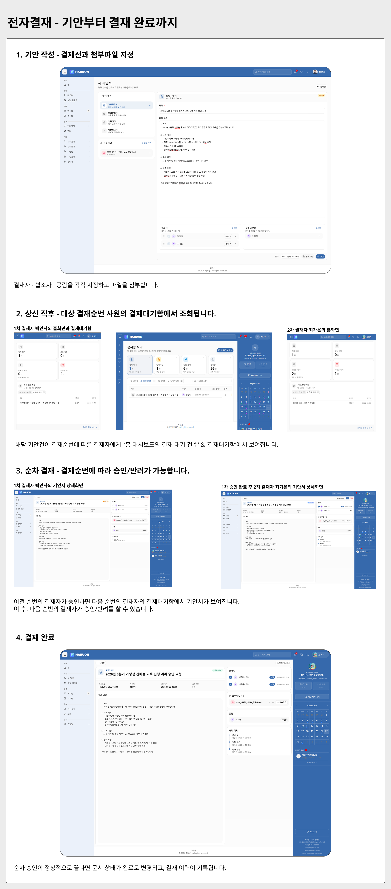
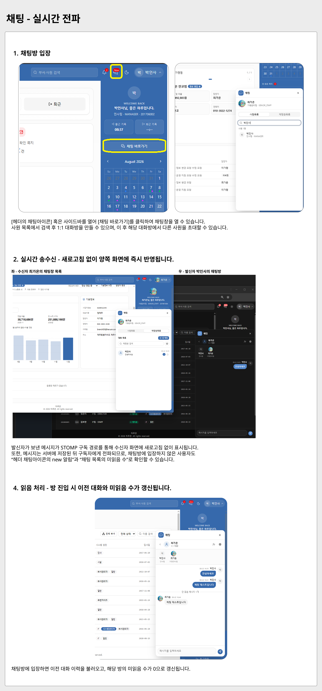
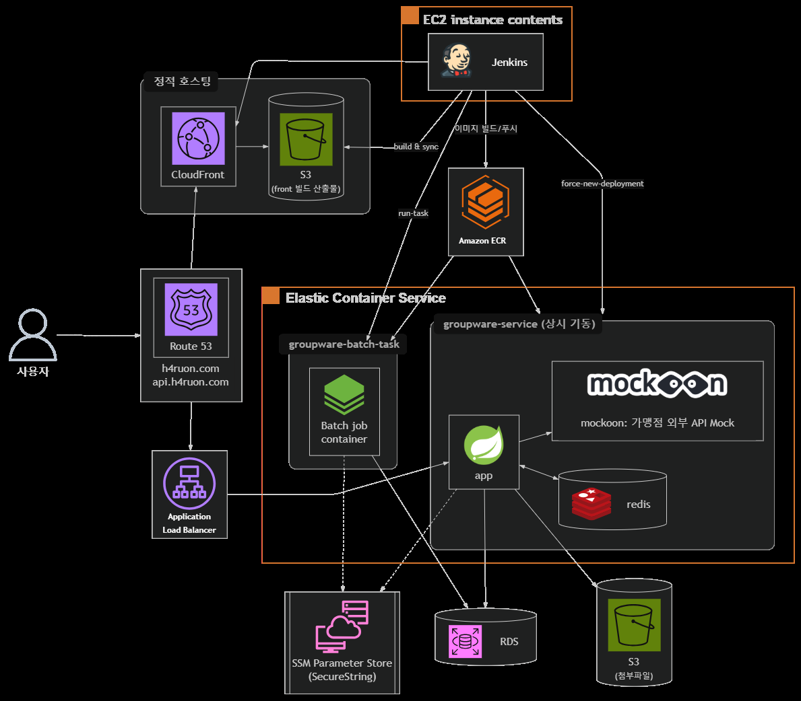
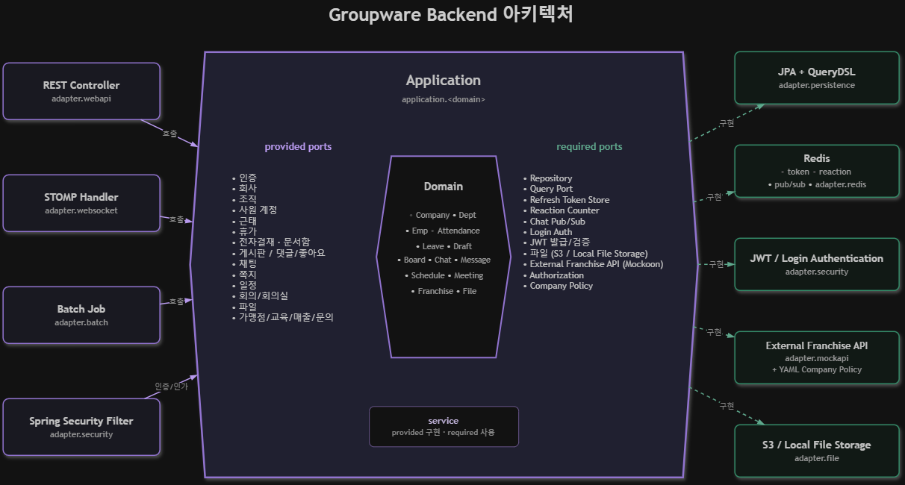
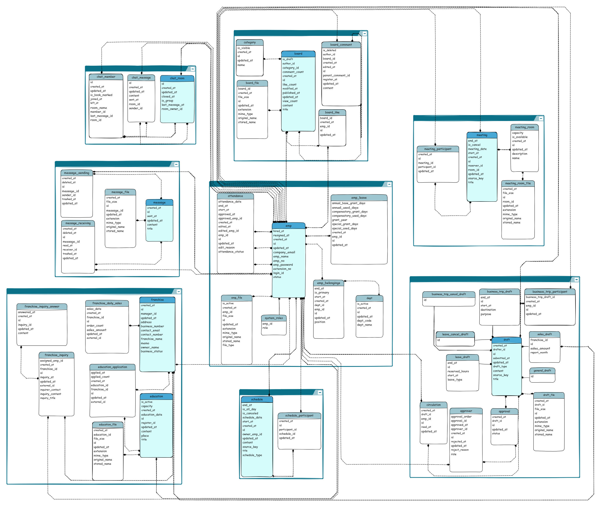

# HARUON Groupware

### **HARUON은 프랜차이즈 본사를 가정해, 사내 업무와 가맹점 관리를 한 시스템으로 묶은 그룹웨어입니다.**

> HARUON 그룹웨어는 조직 내 소통과 협업에 필요한 기능을 하나의 플랫폼에서 제공하는 소프트웨어입니다.
> 전자결재 · 메신저 · 일정관리 · 채팅 등 사내 커뮤니케이션과 결재 흐름을 갖추었습니다..
> 또한 Mockoon을 이용하여 외부 가맹점 서버를 가정하였고, 
> 외부 가맹점의 매출 · 교육신청 ·문의를 배치로 동기화 하도록 구성하였습니다.

### **라이브 데모**
- https://h4ruon.com

### 이전 구현
- 이 프로젝트는 팀 프로젝트에서 MVC로 구현한 도메인을, 개인으로 포트-어댑터로 리팩토링한 결과물입니다.
- [SkillUp86/haruon](https://github.com/SkillUp86/haruon) — 동일 도메인, Spring MVC · MyBatis · JSP (2024.12 ~ 2025.02, 팀 프로젝트)

> 이전에는 패키지를 도메인 기준으로 나눴지만 계층 구분이 이름에만 있어,
> 
> Service 하나에 도메인 규칙 · 트랜잭션 · 외부 호출 · DTO 변환이 함께 쌓였습니다. 도메인 간 연동도 Service가 다른 Service를 직접
> 호출하면서 의존 방향이 양방향으로 얽혔고, Mapper가 곧 영속성이라 도메인 로직이 SQL과 테이블 구조에
> 묶여 있었습니다.
>
> 그래서 이번에는 경계를 이름이 아니라 **의존 방향**으로 강제했습니다. 
> 
> `domain`은 어떤 계층도 참조하지 않고,
> `application`이 유스케이스를 provided port로 노출하고 필요한 외부 의존은 required port로 선언합니다.
> `adapter`는 그 포트의 양쪽 끝을 구현합니다 — webapi · websocket · batch는 인바운드,
> persistence · redis · file · mockapi는 아웃바운드입니다.
>
> 그 결과 도메인 간 연동은 직접 호출 대신 도메인 이벤트로 처리하고, 외부 가맹점 API도 required port
> 뒤에 있어 Mockoon 어댑터를 실제 가맹점 서버 어댑터로 교체해도 application과 domain은 바뀌지 않습니다.

---

## 🖥 주요 시나리오

### 전자결재 — 기안부터 결재 완료까지
> 결재선 다중 지정과 결재 상태 전이 설계 · 메인 홈에서 결재 대기/상신 건수 집계

<details>
<summary><b>시나리오 살펴보기</b></summary>


</details>


### 채팅 - Redis Pub/Sub 구조로 멀티 서버 실시간 전파
> WebSocket(STOMP)으로 연결된 두 세션 간 메시지 즉시 전파
<details>
    <summary><b>시나리오 살펴보기</b></summary>



</details>

### 일정 - Domain Event 발행을 이용한 도메인 간 연동
> 전자결재 완료 · 회의등록 시 발행되는 도메인 이벤트를 일정 도메인이 구독해 처리
<details>
    <summary><b>시나리오 살펴보기</b></summary>
    
    출장 기안 결재 완료 → 개인·부서 일정 캘린더에 자동 반영 (사원 계정)
</details>

### 배치 - Jenkins 야간 배치를 통한 데이터 정리
> 야간 배치로 일일 매출 동기화 · 근태 확정
<details>
    <summary><b>시나리오 살펴보기</b></summary>

| Jenkins 실행 | 반영 결과 |
|---|---|
|  |  |

야간 배치로 일일 매출 동기화 · 근태 확정 → 부서장 계정에서 사원 근태 캘린더와 가맹점 매출 그래프에 반영
</details>

## 🗂️ 주요 기능

| 기능        | 설명                                                                                         |
|-----------|--------------------------------------------------------------------------------------------|
| 인증 · 권한   | JWT 로그인 및 토큰 재발급, 회원가입 후 인사팀 승인, 역할(사원 · 부서장 · 인사 · 시설 · 가맹점 · 관리자) 기반 메뉴 · API 접근 제어      |
| 조직 관리     | 회사 정보 관리, 부서 등록 · 수정, 부서장 지정, 탐색형 조직도                                                      |
| 사원 관리     | 신규 사원 승인, 사원 목록 · 상세 조회, 정보 수정, 근무 상태 변경, 부서 이동                                            |
| 전자결재      | 일반 · 연가 · 출장 · 매출 기안 작성, 결재선(결재자 · 협조자 · 공람) 지정, 결재함(상신 · 수신 · 완료 · 반려), 임시저장, 취소기안, 문서 출력 |
| 근태 관리     | 출퇴근 기록, 개인 근태 조회, 부서 근태 승인, 야간 마감 배치                                                       |
| 휴가 관리     | 연차 부여 및 잔여 조회, 부서 휴가 현황, 전사 휴가 관리                                                          |
| 일정        | 개인 · 부서 일정 캘린더, 참석자 지정                                                                     |
| 회의        | 회의실 예약, 예약 관리, 회의실 등록 · 관리                                                                 |
| 게시판       | 게시글 작성 · 수정 · 삭제, 카테고리 관리, 댓글, 좋아요, 임시저장                                                   |
| 쪽지        | 메일함 형태 UI(받은 · 보낸 · 임시), 다중 수신자, 안 읽은 쪽지 알림                                                |
| 채팅        | WebSocket(STOMP) 기반 실시간 채팅, 그룹 채팅방, Redis Pub/Sub 메시지 전파                                   |
| 가맹점 관리    | 가맹점 목록 · 상세, 매출 보고, 교육 신청, 문의 응대                                                           |
| 배치        | 일 매출 동기화, 근태 마감, 채팅방 정리, 가맹점 교육 · 문의 동기화(실패 시 재시도 잡 수행)                                    |
| 파일        | S3 기반 첨부파일 업로드 · 다운로드                                                                      |

---

## 🔧 기술 스택
[/뱃지 이미지/]: # (## https://raw.githubusercontent.com/Ileriayo/markdown-badges/master/README.md)
[/로고 유무 확인/]: # (https://simpleicons.org/)

### 언어 · 프레임워크


### 인증 · 보안


### 데이터 · 영속성


### 배치 · 실시간 통신


### 클라우드 인프라


### CI/CD · 컨테이너


### 테스트


### 프론트

- 프론트는 agent context 구성 및 API 문서화와 backend contract를 통한 위임

---
## 🛠 아키텍처

### 인프라 아키텍처



### 백엔드 아키텍처 (포트-어댑터)



## 데이터베이스 ERD




---

## 📂 프로젝트 구성
> 백엔드 · 프론트엔드에 더해 CI 파이프라인 · 외부 가맹점 Mock 서버 · 로컬 개발 환경까지
> 한 저장소에서 관리하는 모노레포 구조입니다.

```
groupware
├── back/                       # 백엔드 (Spring Boot · Hexagonal architecture 구조)
│   └── src/main/java/com/haruon/groupware
│       ├── domain/             # 엔티티 · 도메인 규칙
│       ├── application/        # provided port · required port
│       └── adapter/            # webapi · persistence · security · websocket · batch · redis · file · mockapi
│   └── src/main/resources
│       ├── db/migration/       # Flyway 스크립트
│       └── Dockerfile-server   # 백엔드 컨테이너 이미지 정의
├── front/                      # 프론트엔드 (React · TypeScript · Vite)
│   ├── src/app/                # 라우터 및 전역 설정
│   ├── src/features/           # 도메인별 api · components · lib · model · pages
│   ├── src/shared/             # 공통 UI · API 클라이언트 · 유틸
│   └── e2e/                    # Playwright E2E 시나리오
├── ci/                         # Jenkins 파이프라인 
├── vars/                       # ECS 배치 잡 실행 스텝
├── mockoon/                    # 가맹점 외부 API Mock 서버 정의
└── compose.yaml                # 로컬 개발용 MySQL · Redis · Mockoon
```

---

## 📑 초기 설계 문서

| 문서                           | 설명                           |
|------------------------------|------------------------------|
| [ERD](docs/GroupwareERD.png) | 데이터베이스 테이블 관계도               |
| [도메인 모델](docs/도메인모델.md)      | 애그리거트 · 엔티티 · 값 객체와 상태 코드 정의 |

---

## 🗓 개발 기간
2026.3.21 ~ 2026.8.11 (4개월 21일)

| 기간               | 핵심 작업                       |
|------------------|-----------------------------|
| 03.21 ~ 04.19    | 요구사항 정리 및 도메인 설계            |
| 04.20 ~ 05.25    | Application 계층 구현           |
| 05.26 ~ 06.27    | Adapter 및 API 구현            |
| 06.28 ~ 07.05    | Claude Code 에이전트 구성 및 개발 준비 |
| 07.06 ~ 07.19    | 프론트엔드 위임                    |
| 07.20 ~ 08.05    | AWS 배포 및 CI/CD 구축           |
| 08.06 ~ 08.11    | 통합 마감·품질 보완 및 기능 안정화        |

